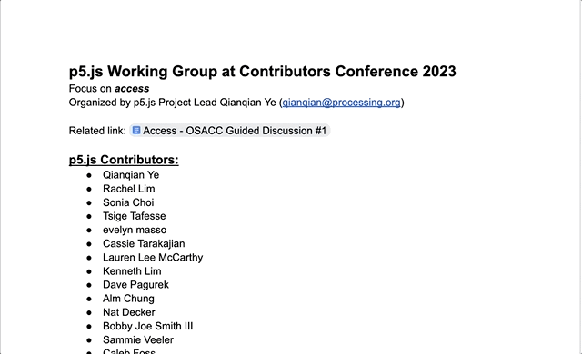
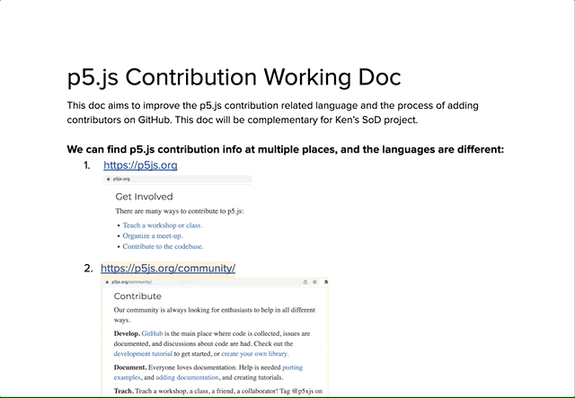
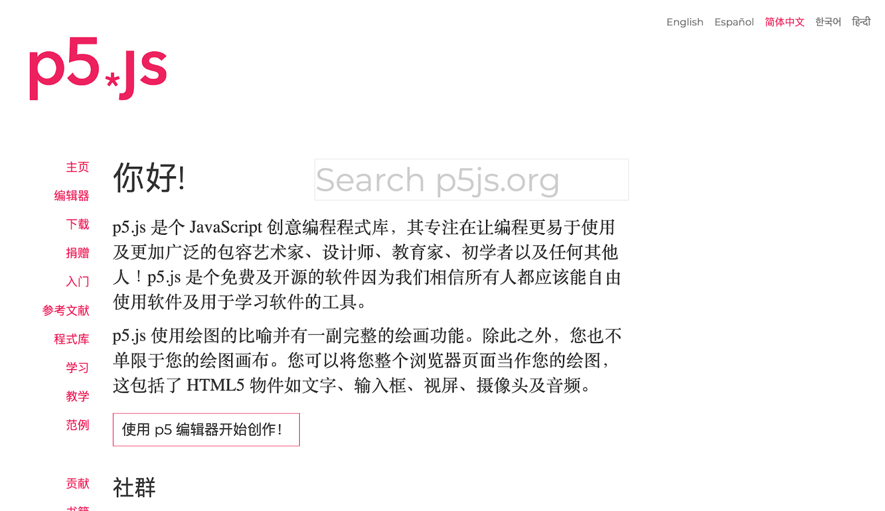
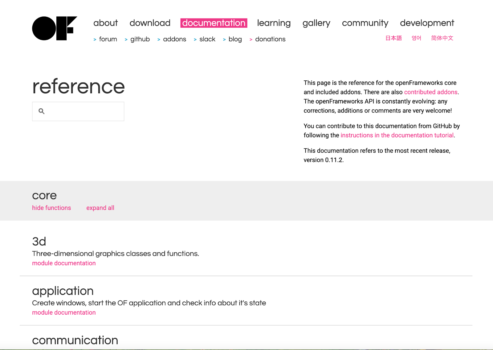
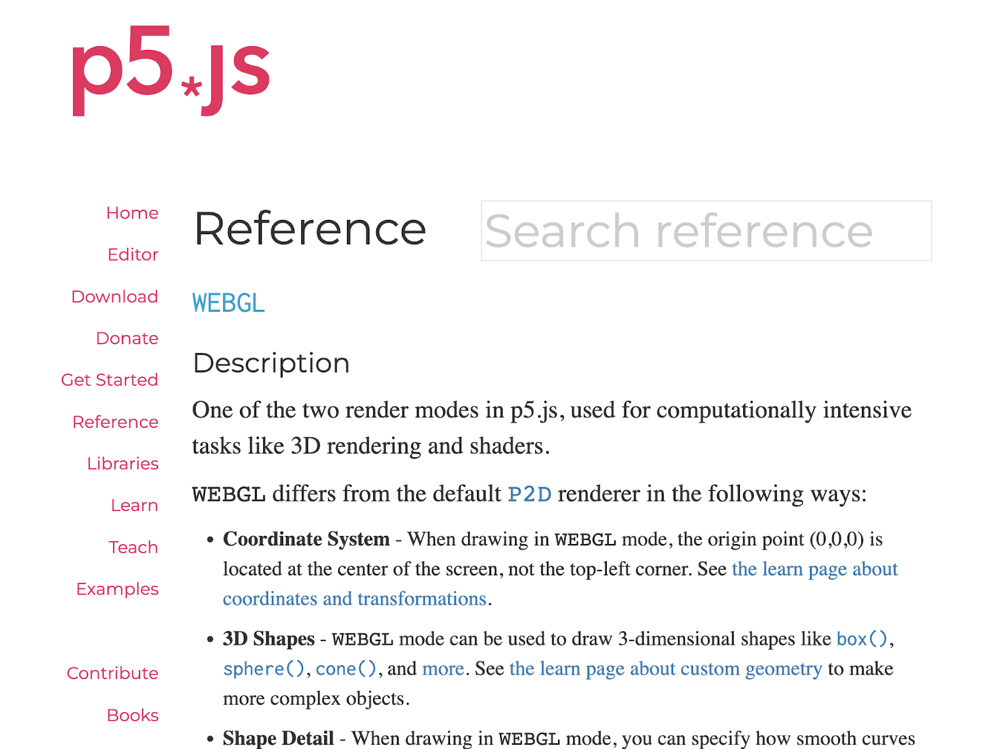

## **Summary: p5.js Working Group at OSACC 2023**

At Open Source Arts Contributor Conference, 2023

April 14-16, University of Denver

Working groups organized by p5.js Project Lead [Qianqian Ye](https://qianqian-ye.com/)

Notes organized by [Karen Abe](https://karenabe.com)

**Table of Contents:**
* [Introduction](#introduction)
* [Working Group: Prioritizing Access & Updating p5.js Community Statement / Code of Conduct / p5.js Definition](#)
* [Working Group: Open Source Software Translation](#)
* [Working Group: p5.js GitHub Issues](#)
* [Working Group: Reducing Barriers to Entry for Learning]()

### **Introduction**

The p5.js working group at Open Source Arts Contributor Conference in 2023 aimed to provide an opportunity for p5.js contributors to come together to discuss ways to make p5.js more accessible both as open-source software and as a community. In these working groups, contributors troubleshoot current p5.js issues, brainstormed methods for better contributor workflow, and resolidify p5.js purpose.

The p5.js contributors at this conference include: evelyn masso, Bobby Joe Smith III, Alm Chung, Sarah Ciston, Caleb Foss, Kenneth Lim, Lauren Lee McCarthy, Tanvi Kumar, Rachel Lim, Tanvi Sharma, Dave Pagurek, Qianqian Ye, Sonia Choi, Cassie Tarakajian, Kate Hollenbach, Tristan Espinoza, Tsige Tafesse, Nat Decker, Sammie Veeler, and Munus Shih.

Each working group consisted of 3-10 contributors. Contributors were allowed to move and explore various groups through the working sessions. Some groups merged or diverged into smaller groups to facilitate conversation.

Contributors were divided and worked on the topics below:

* Prioritizing Access & Updating p5.js Community Statement / Code of Conduct
* Open Source Software Translation
* P5.js GitHub Issues
* Reducing Barriers to Entry for Learning

Below is the [shared document](https://docs.google.com/document/d/1FkvaVczYpFQA6nShaciGCKdPuDoHQYSbv9K7On2yEv8/edit) with notes taken during the discussion:

Below are discussion summaries from five groups.

---

### **Prioritizing Access & Updating p5.js Community Statement / Code of Conduct / p5.js Definition**

**Led by** evelyn masso, Sonia Choi, Nat Decker, Bobby Joe Smith III, Sammie Veeler, Xin Xin

**Referenced Documents**
* [p5.js Contribution Working Doc](https://docs.google.com/document/d/1hDvrkLhCZsYRa5ilCT6yLtqIT0e-FqVH0i7zDtnsPJA/edit#heading=h.qxv2zyotehr)
* [p5.js Community Statement , Access Statement Working Doc](https://docs.google.com/document/d/1Yno4QOf30wv8FcItu78_LkcHlVYHgl0LZEM2tz6BUZ4/edit)
* [p5.js is...Working Doc](https://docs.google.com/document/d/1dMAg4EuumVno27jEQnujlvjXtbj6lkgpXmGEkpWDYlM/edit#heading=h.qxv2zyotehr)

This joint working group discussed ways to make contributing to p5.js more accessible, brainstormed a new definition of p5.js, and collectively rewrote the p5.js Community Statement and Code of Conduct. Although the working group did not reach the completion of a definitive definition or revised statement, the conversations helped shape the organization's intentions in moving forward.

When discussing the accessibility of contributing to p5.js the group put together the [p5.js Contribution Working Doc](https://docs.google.com/document/d/1hDvrkLhCZsYRa5ilCT6yLtqIT0e-FqVH0i7zDtnsPJA/edit#heading=h.qxv2zyotehr). The document lists places where p5.js contribution methods are mentioned, forms of contribution (code & non-code contribution), as well as the language that is used to describe contribution work. The group discussed ways to consolidate some of the informati

The [p5.js Contribution Working Doc](https://docs.google.com/document/d/1hDvrkLhCZsYRa5ilCT6yLtqIT0e-FqVH0i7zDtnsPJA/edit#heading=h.qxv2zyotehr) includes screenshots and examples of places p5.js contribution work is described.

ID: GIF screen capture scrolling through a document. Lines of bullet point text and screenshots of various websites are included.

In updating the p5.js Community Statement / Code of Conduct, the group started off with questions about the current p5.js Access and Community Statement. Through conversation, the group discussed possibilities of combining the p5.js Access and Community Statements as a comprehensive document as well as aligning the p5.js Community Statement to the Process Foundation’s practices. Furthermore, the group discussed the possibility of having these statements as a living document by having them routinely updated and open for community suggestions. The group navigated the compilations of including explicit language– such as terms like anti-racist and anti-capitalist– in their statements and the need for transparency about how the organization's values are translated into action.

Additionally, the group also had a share-out session on the topic “p5.js is…” as a way to develop a more succinct definition for p5.js to be used across all platforms. The [p5.js is...Working Doc](https://docs.google.com/document/d/1dMAg4EuumVno27jEQnujlvjXtbj6lkgpXmGEkpWDYlM/edit#heading=h.qxv2zyotehr) provides a list of current definitions used for p5.js across various websites and social media platforms. Then, the document listed questions to push contributors through the history, purpose, and tone that could be included in this new definition. As an exercise, contributors each took a shot at writing a definition for p5.js. The rest of the working group time was dedicated to the collaborative editing of statements. The document can be found here: [p5.js Community Statement , Access Statement Working Doc](https://docs.google.com/document/d/1Yno4QOf30wv8FcItu78_LkcHlVYHgl0LZEM2tz6BUZ4/edit).

---

### **Open Source Software Translation**

**Led by** Alm Chung, Kenneth Lim

**Reference Documents**

[Notes](http://docs.clinicopensourcearts.org/p/GInsVRShRFnm7D1kdB-t)

[Alm (Alice) Chung](https://almchung.github.io/) and [Kenneth Lim](https://limzykenneth.com/), two translation contributors to p5.js, led the discussion on the translation process in software, complications in translation, and reimaging new approaches to translation work. 

The P5.js homepage is translated into 5 different languages with the help of contributors.

The discussion opened with the use of machine translation, its pros, cons, and uses as an accessibility feature. The pros included the speed that comes with the use of machine translation, while the cons included the limited language options offered. The group also shared the difficulties in verifying currently existing machine translation tools as many of them are inaccurate and problematic.

The group reflected on the process of translating documents for the Processing Foundation and agreed that translation work is best done by first-language speakers. The group also discussed the possibilities of expanding translation work through crowdsourcing. However, to maintain the quality of translation, the group discussed the need for community guidelines and the standardization of commonly used words. An example of successful standardization is the translation guide created for the “friendly error system.” As all translations for the error messages are made to be conversational to ensure the tone of the error helped encouraged people to learn. As the current translation workflow requires contributors to have to come back when updates are made, better documentation is needed to ease the process of onboarding new translation contributors and simplify the current labor-intensive structure.

---

### **p5.js GitHub Issues**

**Led by** Alm Chung, Kenneth Lim, Dave Pagurek

**Reference Documents**
* [p5.js Issue / Pull Request Tracking Guideline](https://docs.google.com/document/d/1bJBysHudrtX8tgA7I5DQjWBgMuFR1KrzlGlOu3CC52M/edit)

[Alm (Alice) Chung](https://almchung.github.io/), [Kenneth Lim](https://limzykenneth.com/), and [Dave Pagurek](https://www.davepagurek.com/) led the discussion on the current p5.js issue workflow, ways for better Pull Request tracking, and code documentation.

The discussion opened by identifying the current structure of the p5.js issue reporting system. As contributors can currently report an issue via Discord and GitHub, the group discussed the possibility of differentiating the two filing methods. The current flow allows people to see the [Contributor Docs Site](https://p5js.org/contributor-docs/#/) first– which is great– but found that many people struggle to find GitHub directly from p5.js.org or the p5.js web editor. Ideas such as color coding, having function/class directly link to source code, and implementing UX on the site that provides highlights on the sidebar were discussed as solutions. The group found that the OpenFrameworks doc would be a great reference to organize code in sections with high-level descriptions to provide better documentation for the code.

OpenFramework documentation tab provides a thorough guide about code for various topics

The group reviewed the [p5.js Issue / Pull Request Tracking Guideline](https://docs.google.com/document/d/1bJBysHudrtX8tgA7I5DQjWBgMuFR1KrzlGlOu3CC52M/edit) draft by Qianqian Ye to set “clear expectations for contributors/stewards/project leads working on issues and pull requests.” The document is open for community input and surveys about the timeline for issue filing. Other ideas that were brought up include developing a Youtube series on how to file issues and write unit tests, and building a template for website design changes.

---

### **Reducing Barriers to Entry for Learning**

**Led by** Dave Pagurek

[Dave Pagurek](https://www.davepagurek.com/)–WebGL Steward for p5.js, led a discussion on ways p5.js can reduce their barrier to entry for learning. Pagurek shares their passion for this topic due to their experience with WebGL as shaders are “notoriously hard to jump into, and knowing when to use which tool (framebuffers, p5.Geometry, etc) requires a lot of background knowledge.” Pagurek shares their hope to provide more guided tutorials, encourage more tutorial contributors, or create a modified API system.

Current p5.js Reference page on WebGL.

When discussing how to make shaders more approachable, the group identified the need for better documentation to motivate why people would want to use shaders instead of pixels. Documentation can be done in the form of a blog on the p5.js website to explain concepts or updating the p5.js learn page. However, noted that this website would need to have a publishing platform system (but not WordPress) or a static site generation, and would be helpful if there is project funding to have one person tasked to make these website changes. In addition, to simplify the process, the group had ideas of removing the boilerplate for GLSL (OpenGL Shading Language) rather than building new API tools, especially for beginners.

The group then critically examined current issues with the friendly error system, WebGL codebases, and an [issue regarding web accessibility](https://github.com/processing/p5.js/issues/4721). In all these aspects, the need for a dataflow or system overview diagram as well as lifecycle information to better document and streamline tackling these issues.
