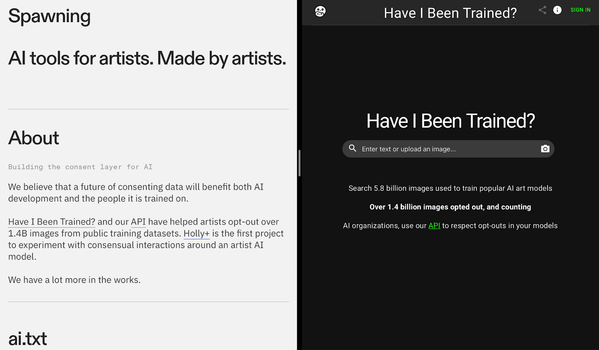
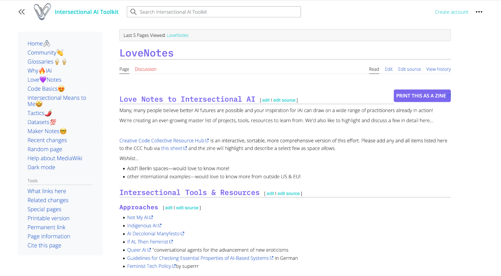
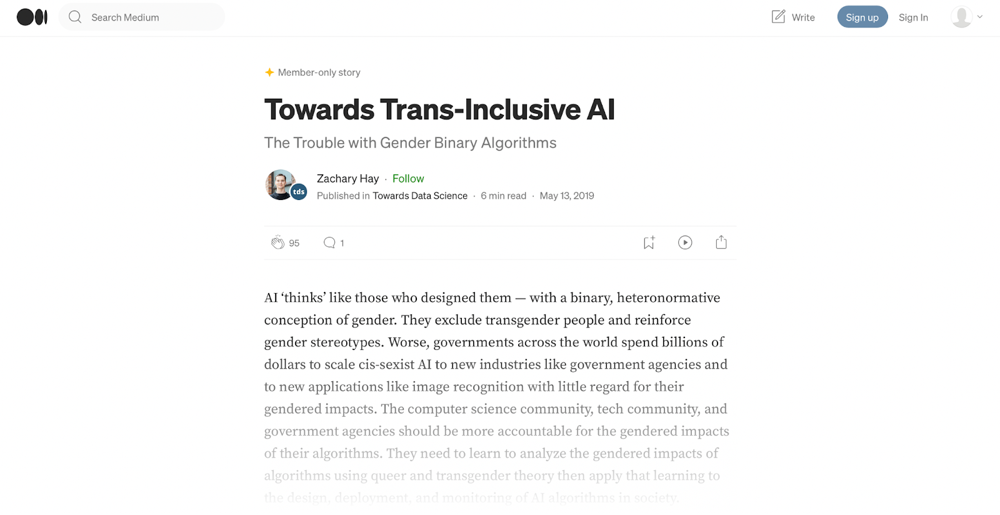

## **Guided Discussion on Future Thinking/AI**

At Open Source Arts Contributor Conference, 2023

April 16, University of Denver

Facilitated by Cassie Tarakajian, Alice Chung, Sarah Ciston, Roopa Vasudevan

Notes organized by Karen Abe

Template for Note Organization from Katie Liu ([Access](https://docs.google.com/document/d/11GpvFcTqkbCiM6wGIvInhO95KL0UQE05s2LVq6D780g/edit) Document)

**Table of Contents:**

* [**Introduction**](#introduction)
* [**Discussion Summary: Relationship to Tech Companies**](#relationship-to-tech-companies)
* [**Discussion Summary: Empowering Creativity**](#empowering-creativity)
* [**Discussion Summary: Tools, Stewardship, Responsibility**](#tools-,-stewardship-,-responsibility)
* [**Discussion Summary: Newcomers and Guides: Getting Your Feet Wet**](#newcomers-and-guides:-getting-your-feet-wet)
* [**Resources**](#resources)

### Introduction

The "Future Thinking and AI" discussion session at the Open Source Arts Contributor Conference in 2023 aimed to explore the transformative potential and risks associated with AI and society. As artists, programmers, and scholars, discussion participants examined AI tools and tech culture critically to reimagine possibilities for a more inclusive future.

The Future Thinking/AI guided discussion started with a 5-minute introduction, followed by 45 minutes for smaller group discussions and note-taking in 4 different subtopics. The subtopics for the Future Thinking/AI guided workshop were: Relationship to Tech Companies, Empowering Creativity, Tools, Stewardship, Responsibility, Newcomers and Guides: Getting Your Feet Wet.

The subtopic discussion aimed to leave room for everyone to speak. The groups were encouraged to embrace awkward silences, be kind and generous, and share space. The shared document was used to take notes or as a way to contribute to participants who preferred not to speak out loud. The discussion ended with a 10-minute closing share-out with representatives from each subtopic group. 

Below is the [NotePad](http://docs.clinicopensourcearts.org/p/future-thinking) with notes taken during the discussion:

Below are discussion summaries from four groups.

---

### Relationship to Tech Companies

**Discussion Lead:** Roopa Vasudevan

[Roopa Vasudevan](https://roopavasudevan.com) – media artist, computer programmer, and scholar, led a discussion on people’s relationships with tech companies thinking through the intersection of AI and its impacts as well as ownership, infrastructure, and reliance.

The discussion started off with a conversation on the exploitation of “open source” culture by corporate platforms. One example is how some tech companies utilize the umbrella term "open-source" as their sole claim to ethical practices and shy away from further progress in fostering a more inclusive and supportive culture. Another example is the “copyleft movement” where projects falsely use the term “open source.” In situations where corporate platforms utilize open-source platforms for profit, this results in the labor of open-source contributors being exploited. This led to a discussion about the importance of licensing as a way to protect creativity and the labor of Open Source contributors— who are often people in marginalized/underrepresented communities. One successful example of licensing can be seen with the Open Source Initiative.

[Open Source Initiative](https://opensource.org/osd/) provides clear guidelines on the definition of Open Source Licensing.

Additionally, the group worried about the consequences of the “openness” in open source culture and questioned the right of corporate companies or AI tools to collect data “just because it was open online.” To combat the exploitation of data collection, the group shared tools such as “Spawning AI” and “Have I Been Trained?” to provide APIs that “respect data privacy and consent” by allowing artists to “opt-out” of datasets used to train AI. 

[SpawningAI](https://spawning.ai) &[ Have I Been Trained?](https://haveibeentrained.com) Provide APIs that respect artist work and privacy.

Exploring the concept of “extraction,” the group discussed methods of extricating oneself from these systems that they heavily depend on for their work. The group discussed the potential impacts AI can have on their work life. One negative possibility is that AI would reduce work opportunities or reduce pay for workers. On the other hand, if AI is used to assist workers, similar to the way a 4-day work week was successful in the UK, AI can possibly provide more leisure in the workspace.

To wrap up the discussion, the group shared their aspirations for a healthier relationship with technology and tech companies. They envisioned a culture that values “softness, slowness, and kindness” and strives for spaces where conformity to capitalist ideals is unnecessary. Collective ownership, meaningful creation, and a sense of purpose were underscored as essential principles moving forward.

---

### Empowering Creativity

**Discussion Lead:** Cassie Tarakajian

[Cassie Tarakajian](https://cassietarakajian.com/current-projects)– creator and mentor for the p5.js Editor, and team member of Magenta at Google Research, led a discussion on the intersection of creativity, ethics, and AI/ML.

The discussion started off with thinking through the positive aspects of AI and Machine Creativity. One participant brought up how AI can introduce new levels of accessibility. For example, students can use AI tools to get help with math problems in place of hiring a tutor. When looking at AI as a tool for co-collaboration, the group brainstormed how search engines could improve one’s experience of web surfing, and alt-text generators can assist web accessibility contributors. The group also voiced their hopes for ML to help make the majority-English-based AI tools available in multiple languages. However, at the end of the day, AI can be seen as a “black box” where humans are still behind them to assist with content moderation and other features. The group also discussed the differences between smaller, more specialized models, versus larger, more general-purpose models; the former has the ability to make a targeted impact on creative workflows and protect data privacy.

[Ozi Chukwukeme](https://ozioma.xyz/), a Nigerian-American creative technologist, designer, and web developer, shared about ml5js. ML5.js is a library that “provides access to machine learning algorithms and models in the browser” to make machine learning approachable for a broad audience of artists, creative coders, and students. Ozi shares her experience with Google’s Teachable Machine and how it is an amazing tool to help folks enter the ML space as it demystifies Machine Learning by providing transparency on the ML process.

[Google’s Teachable Machine](https://teachablemachine.withgoogle.com/) allows people to train their own custom ML models.

As the group looked at fun examples such as “Harry Potter Balenciaga”— AI generated video of Harry Potter characters wearing Balenciaga, and “Text.Theatre”— AI fanfiction generator, the group discussed how spending time with a tool can give you more ideas. Looking into more examples, the group found that AI tools are generally a win for smaller teams and studios as they can assist with the creative process. 

---

### Tools, Stewardship, Responsibility

**Discussion Lead:** Sarah Ciston

[Sarah Ciston](https://sarahciston.com)— poet programmer, Ph.D. candidate at USC Media Arts + Practice and named “2023 AI Newcomer” by the German Society for Computer Science, led a discussion on people’s relationships to individual AI tools by examining the emotional reaction to tools, thinking through guidelines and brainstorming goals for these tools.

The discussion opened with many concerns the group had with AI. Examples included image stealing, the generation of limited aesthetics, harmful labor practices, and lack of transparency. According to a TIME article, in developing ChatGPT, OpenAI has long exploited laborers in Kenya through long hours of work, low pay, and exposure to sensitive content.

[TIME](https://time.com/6247678/openai-chatgpt-kenya-workers/) shares a quotation by Andrew Strait, an AI ethicist, “ChatGPT and other generative models are not magic – they rely on massive supply chains of human labor and scraped data, much of which is unattributed and used without consent.”

When discussing the group's goals with AI, many expressed desires for better labor practices, licensing, and expansion of accessibility. One of the discussion participants expressed how “cheap AI is scary” and hopes for AI to be expensive— for institutions to pay for— so data training laborers and content moderators can be properly trained and compensated while keeping AI accessible. Another participant shared an idea of how AI tools can be created with consideration for their environmental costs. In that discussion, the following questions were proposed: Would our relationship change if you had a limit of 10 prompts per year or a carbon cost? How can we acknowledge the weight of what it means to use the tool, even if it is free? 

The group came up with a metaphor: “Comparing these systems to fast fashion, the right to use the tool is not a given. Just because it's there, do we have the right to use it, and how does that come at the cost of those making it?” With a collective understanding of how sharing and creating space for alternative AI tools is important, the group looked at resource lists like the “Intersectional AI Toolkit” started by Sarah Ciston. This toolkit serves as a platform that “gathers ideas, ethics, and tactics for more ethical, equitable tech” and offers an “approachable guide(s) to both intersectionality and AI.”

Created with the help of many contributors, the[ Intersectional AI Toolkit](https://intersectionalai.miraheze.org/wiki/LoveNotes) is an “ ever-growing master list of projects, tools, resources to learn from.”

---

### Newcomers and Guides: Getting Your Feet Wet

**Discussion Lead:** Alm (Alice) Chung

[Alm (Alice) Chung](https://almchung.github.io/)—media artist, a researcher at UCSD, and contributor to the p5.js Friendly Errors System, led the discussion on people’s introduction to AI by examining people’s curiosity about the tool, the current tech landscape, and personal usage of AI.

The discussion started off with participants answering the question, “What made you consider learning/using AI?” Many expressed that their interest in AI was sparked due to hype, boundary exploration, and the leisure of non-human interaction; but also as a way to examine the impacts of new technology and test the “visibility” of these machines.

[Medium](https://towardsdatascience.com/towards-trans-inclusive-ai-a4abe9ad4e62) article by Zachary Hay shares how current AI models can only think like their designers, “with a binary, heteronormative conception of gender.”

In response to the “pace of AI,” the group agreed that the pace is entirely being set by big tech while legal regulations and ethical discussions are often compromised to pump out these tools to the public. A question was proposed “Are there organizations capable of doing this task at an equitable rate?” The group also identified how cultural artifacts are aggregated in a viral way due to AI.

Wrapping up, the group discussed if individuals have the agency to refuse the current pace of AI. Many expressed concern that current systems often don’t provide agency to refuse; for instance, being unable to turn off auto-complete. The group brought up the question, “What would AI look like if it was designed by the most marginalized people or those with different levels of emotional intelligence and structural oppression.”

---

### RESOURCES

**AI Tools Mentioned During Discussion:**

* ml5js: [https://ml5js.org](https://ml5js.org)
* ChatGPT: [https://openai.com/blog/chatgpt](https://openai.com/blog/chatgpt) 
* Google Teachable Machine: [https://teachablemachine.withgoogle.com](https://teachablemachine.withgoogle.com) 
* MidJourney: [https://www.midjourney.com/](https://www.midjourney.com/home/?callbackUrl=%2Fapp%2F)
* Tensorflow: [https://www.tensorflow.org](https://www.tensorflow.org) 
* The new Bing: [https://www.bing.com/new](https://www.bing.com/new) 
* Bloom: [https://bloomai.co](https://bloomai.co) 
* Feminist dataset: [https://carolinesinders.com/feminist-data-set/](https://carolinesinders.com/feminist-data-set/) 
* GDPR: [https://gdpr-info.eu](https://gdpr-info.eu) 
* Runway: [https://runwayml.com](https://runwayml.com) 
* Autodesk generative modeling: [https://www.autodesk.com/solutions/generative-design](https://www.autodesk.com/solutions/generative-design) 
* Dalle-2: [https://openai.com/dall-e-2](https://openai.com/dall-e-2) 

**Resources / Datasets**

* Spawning AI: [https://spawning.ai](https://spawning.ai) 
* Have I Been Trained: [https://haveibeentrained.com](https://haveibeentrained.com) 
* Hugging Face: [HuggingFace.co](https://huggingface.co)
* CoLab: [CoLab](https://research.google.com/colaboratory/)
* Cybernetics Digital Library: [https://www.are.na/david-hecht/cybernetics-digital-library/followers](https://www.are.na/david-hecht/cybernetics-digital-library/followers) 
* Interactional AI Toolkit: [https://intersectionalai.miraheze.org/wiki/LoveNotes](https://intersectionalai.miraheze.org/wiki/LoveNotes) 

**Projects**

* Who Can Afford To Be Critical: [https://afonsodematos.com/Who-can-Afford-to-be-Critical](https://afonsodematos.com/Who-can-Afford-to-be-Critical)
    * “Who Can Afford To Be Critical? was developed as the final project for the Information Design MA at Design Academy Eindhoven, Year 2021/2022. The research conducted is communicated through a set of different materials: posters, flyers, t-shirts, videos, a website and four zines. These objects are components of a campaign that aims to target the site per excellence of ‘Critical Design’: Design Academy Eindhoven and its graduation show.”
* Glaze Project: [https://glaze.cs.uchicago.edu](https://glaze.cs.uchicago.edu)
    * “We are an academic research group of PhD students and CS professors interested in protecting Internet users from invasive uses of machine learning… our only goal is to explore how ethical security techniques can be utilized to develop practical solutions and (hopefully) help real users.”
* Black Lunch Table: [https://www.blacklunchtable.com](https://www.blacklunchtable.com) 
    * “Black Lunch Table [BLT] is a radical archiving project. Our mission is to build a more complete understanding of cultural history by illuminating the stories of Black people and our shared stake in the world. We envision a future in which all of our histories are recorded and valued.”

**Reads**

* The Cathedral and the Bazaar: [http://mijowa.github.io/CatB/](http://mijowa.github.io/CatB/)
    * “This project aims to present Eric S. Raymond's classic essay on open-source development with improvements to visual design and user experience. Specific areas of focus include typesetting, navigation, and HTML5 semantics.
* “The Automation Charade” by Astra Taylor: [https://logicmag.io/failure/the-automation-charade/](https://logicmag.io/failure/the-automation-charade/)
    * “The rise of the robots has been greatly exaggerated. Whose interests does that serve?”
* “Normal Science” by Alexander Galloway: [http://cultureandcommunication.org/galloway/normal-science](http://cultureandcommunication.org/galloway/normal-science) 
* “Atlas of AI” by Kate Crawford:  [https://www.katecrawford.net](https://www.katecrawford.net) 
    * “In Atlas of AI: Power, Politics, and the Planetary Costs of Artificial Intelligence Crawford reveals how the global networks underpinning AI technology are damaging the environment, entrenching inequality, and fueling a shift toward undemocratic governance
* “We Refuse We Want We Commit”: [https://book.strategictransparency.network/vol1/](https://book.strategictransparency.network/vol1/) 
    * “Over the last several years—and, in particular, as buzzwords like Web3, the Metaverse, and the Semantic Web have gained traction within the popular imagination—we’ve been hearing and speculating a lot about the next iteration of the Web. Myriad possibilities and avenues have been proposed and championed, all of which promise to change things, to help us build community, to center people more, and to take power away from those who hoard and exploit it. The hype around these systems makes the idea of the “next” Internet seem fresh, exciting, and novel. There is optimism in finding new territory, a new way of thinking—one that has, ostensibly, not been corrupted by surveillance capitalism and advertising-driven business models.”
* “Coltan” by Michael Nest
    * “A decade ago no one except geologists had heard of tantalum or 'coltan' - an obscure mineral that is an essential ingredient in mobile phones and laptops. Then, in 2000, reports began to leak out of Congo: of mines deep in the jungle where coltan was extracted in brutal conditions watched over by warlords. The United Nations sent a team to investigate, and its exposé of the relationship between ”violence and the exploitation of coltan and other natural resources contributed to a re-examination of scholarship on the motivations and strategies of armed groups.”
