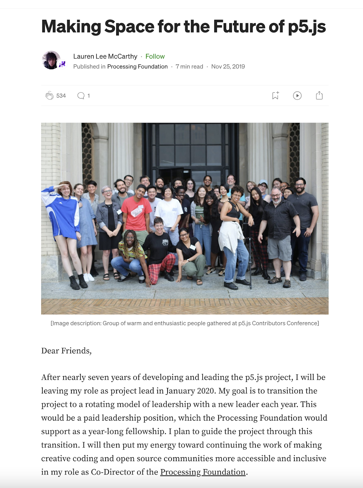

## **Guided Discussion on Sustainability**

At Open Source Arts Contributor Conference, 2023

April 16, University of Denver

Facilitated by Chris Coleman & Theo Watson

Notes organized by Karen Abe

**Table of Contents:**

* [Introduction](#Introduction)
* [Discussion Summary: Sustaining Contribution](#sustaining-contribution)
* [Discussion Summary: Sustaining Leadership](#sustaining-leadership)
* [Discussion Summary: Sustaining Funding](#sustaining-funding)
* [Discussion Summary: Sustaining Community](#sustaining-community)
* [Discussion Summary: Sustaining Maintenance](#sustaining-maintenance)
* [Resources](#resources)

### **Introduction**

The Sustainability guided discussion session at the Open Source Arts Contributor Conference in 2023 provided space for participants to share their experience with open-source contributor culture and brainstorm better ways to “sustain” healthier communities and software. As a wide range of open-source project creators, contributors, users, and maintainers were part of the discussion, participants were able to collectively reimagine both logistical and social practicalities in keeping open-source projects alive.

The Sustainability guided discussion started with a 5-minute introduction, followed by 45 minutes for smaller group discussions and note-taking in 5 different subtopics. The subtopics for the Sustainability guided workshop were about sustaining these sectors: contribution, leadership, funding, community, and sustainable maintenance.

The subtopic discussion aimed to leave room for everyone to speak. The groups were encouraged to embrace awkward silences, be kind and generous, and share space. The shared document was used to take notes or as a way to contribute to participants who preferred not to speak out loud. The discussion ended with a 10-minute closing share-out with representatives from each subtopic group. 

Below is the [NotePad](http://docs.clinicopensourcearts.org/p/OSACC_Sustainability) with notes taken during the discussion:

Below are discussion summaries from five groups.

---

### Sustaining Contribution

The “Sustaining Contribution” discussion allowed participants to reconsider the definition of a “contributor” and collectively identify characteristics of a healthy contributor culture.

The discussion started with defining what a contributor is. The group identified that a contributor is anyone who helps a project move a step forward, which can come in various forms from code, translation, writing, and so on. Participants highlighted the need for “contributors” to be defined in the Code of Conduct as there is uncertainty between “recognition” and “contribution.” Referring to Kate Crawford’s “Atlas of AI” it is important to recognize the role of countless others who bring software and tools alive including the laborers involved with lithium mining, custodians, and caretakers who all contribute to pushing tech and software-related projects forward. As participants were pushed to ponder about “who has the privilege to contribute,” they were encouraged to consider ways to lower the barrier to contribution in their open-source projects.

The p5.js Contributor Docs outline ways one can become a contributor.

In terms of contribution culture, participants discussed methods to promote a more inclusive onboarding process. Although asynchronous work is possible with contribution work, participants identified the importance of connection via digital platforms. Whether it be casual conversation or organized co-working time, fostering connection for contributors is an important first step to making contributors feel welcomed. Clear communication, strong contributor documentation, and defining collective goals are essential in helping contributors feel valued, seen, and prideful of their work.

**Resources**

* [All Contributors](https://allcontributors.org)
    * “We’ve built a bot to automate the tedious stuff for adding project contributors, so you can focus on your project instead of managing your ReadMe.”
* [Atlas of AI](https://www.katecrawford.net)
    * “In Atlas of AI: Power, Politics, and the Planetary Costs of Artificial Intelligence Crawford reveals how the global networks underpinning AI technology are damaging the environment, entrenching inequality, and fueling a shift toward undemocratic governance”
* [Urban Sketchers ](https://urbansketchers.org/)(example of local and global chapters)
    * “Urban Sketchers is a global community of sketchers dedicated to the practice of on-location drawing. We share our love for the places where we live and travel—one drawing at a time”
* [LiveCode](https://livecode.org/)
    * “Build apps using our visual development environment and our easy-to-understand programming language that has no limits to what you can create.”

---

### Sustaining Leadership

The “Sustaining Leadership” discussion focused on tackling “burnout” by reimaging healthy leadership structures and strategies in role transfer processes.

The discussion started with each participant sharing their personal experience with burnout, transition of leadership, and organizational structures. As burnout was a common experience for many participants, Theo Watson – co-founder of OpenFramework, highlighted how there “shouldn't be a situation where sequential people get burnt out.” Watson shared their experience of embracing a more decentralized structure where the projects are owned by everybody. Participants identified how strong funding and documentation are key to supporting decentralized structures and smoother transition of responsibilities.

In a conversation about assessing and transitioning leadership, Qianqian Ye– current p5.js lead, highlighted the importance of “assessing invisible labor when evaluating candidates” since loud and more visible candidates may be unconsciously favored. As open-source projects are usually dependent on fluctuating forms of funding, transparency about project finances is important in preparing the incoming leadership. For the person leaving, [Lauren Lee McCarthy](https://lauren-mccarthy.com/)– creator of p5.js, shared their experience of passing on a leadership role. McCarthy described how they wrote an open letter describing their “aspirations” for the organization along with projects they are okay to “sunset” depending on funding. Reflecting on their own experience, Ye mentions the importance of easing pressure on the incoming person. Ye highlights how accepting how “open source means being comfortable with messiness” has helped them navigate the transition. Upon listening to each participant’s story, the group agreed that the onboarding process should be as easy as the offboarding process.

A letter to the public published by Lauren Lee McCarthy on [Medium](https://medium.com/processing-foundation/making-space-for-the-future-of-p5-js-d3c6bd3da9ac).

---

### Sustaining Funding

The “Sustaining Funding” discussion centered on the participant’s experience with funding for their open-source projects, navigation of funding politics, and reimaging worlds for better contributor compensation.

The discussion started with participants sharing their individual experiences with funding, grants, and resources they utilized to sustain their projects and initiatives. Grant references ranged from national foundations, donation-based funding, and academic institutions. One participant shared their experience using crowdfunding platforms such as Kickstarter and the issue of taxes placed on that income. Organizations such as NEWINC were referenced as there are communities and organizations designed to help non-profits build stronger business plans. As participants exchanged tips on the grant writing process, they highlighted the power of becoming a non-profit to boost eligibility for grants. In terms of grant writing, some participants suggested applying for grants to tackle specific projects instead of infrastructure building.

NEWINC– an incubator for people working at the intersection of art, design, and technology, providing programs for the community.

Additionally, participants discussed the social complications involved in sustaining funding as maintaining relationships with wealthy donors and investors often becomes crucial in keeping open-source projects alive. This conversation led to discussions on the function of the “Board of Funders” versus “Boards as Guidance.” Participants reimagined Co-Op models with checks and balances to allow for teams or communities to be able to hire and fire the Board. Thinking through the different connotations of open-source versus creative commons, the group also reimagined a world where “tax” can be collected from those who profit off of open-source tools, so that “tax” can be diverted to compensate contributors who help build these tools.

When looking into collaborations between open-source tools and educational institutions, one participant proposed an idea to substantiate an invoice-generating system for open-source platforms. As educational institutions often face tax restrictions when it comes to donating money, this invoice-generation system will streamline the financial processes and make “paying” for open-source tools easier.

**Grant Resources**

* [Knight Foundation](https://knightfoundation.org/)
* [National Endowment for the Arts](https://www.arts.gov/)
* [Reclaim Hosting](https://www.reclaimhosting.com/)
    * Reclaim Hosting provides institutions and educators with an easy way to offer their students domains and web hosting that they own and control.
* [YunoHost](https://yunohost.org/en/whatsyunohost)
    * Democratizing self-hosting
* [White Pube](https://thewhitepube.co.uk/funding-library/)
    * Funding Library
* [Canadian Council](https://canadacouncil.ca/glossary/disability-arts)
    * for disability arts

    

---

### Sustaining Community

In the “Sustaining Community” discussion, participants exchanged ideas on ways to instill an uplifting culture in open-source communities, considering methods of intervention and organizing in-person interactions.

Participants started by sharing their individual experiences of getting involved with the open-source community. Many participants highlighted the importance of onboarding community members to the open-source ethos. This involves reminding them to be kind to themselves as they navigate the initial challenges of GitHub and coding. Encouraging contributors to embrace the open-source culture of building on pre-existing work. And, "humanizing contributions" by emphasizing how there are humans behind the code as a way to empower them and appreciate the human aspect of existing digital frameworks. In terms of culture and kindness, participants identified that the tone of the conversation, as well as an invitation from the community, is key to building healthy communities.

When discussing a scenario where a contributor causes a violation, participants brainstormed strategies for intervention. The group identified the importance of a Code of Conduct to be able to reference during an intervention and ensure that the Code of Conduct is presented during the onboarding process to be understood as a document beyond just “terms and conditions.” One participant highlighted how “no one person's contributions are important enough to justify harms to other members of the community.” Additionally, when considering the re-entrance of an offender into the community, the group agreed that it should be “contingent on the approval of the people who were initially harmed.”

The Code of Conduct utilized for OSACC. These terms were reviewed at the start of the conference and also sent out to participants prior to the conference for review.

The group then discussed ways communities can be further brought together by in-person interactions. One participant described how open-source communities can be both “local and global at the same time.” Participants pointed out how facilitating local events and empowering individuals to take the lead in organizing meet-ups are essential to keeping communities alive. Additionally, when throwing out ideas to make sure these in-person interactions have a “low barrier to entry,” the group shared their love for free food, workshops, and informal style meet-ups.

---

### Sustaining Maintenance

The “Sustaining Maintenance” discussion articulated the importance of documentation, the intricacies of maintenance work, and reimagining maintenance workflows and roles. 

The discussion started with sharing the inseparability of documentation and open-source project maintenance. Participants found that documentation should ideally cover core tech/design decisions, meetings, and timelines to make onboarding easier for new contributors. In addition to keeping the documentation up to date with the codebase, participants highlighted the importance of maintaining community forums as a way to keep a project “alive.” This entails the need for better systems that streamline the answering of issue tickets, examples of a “good” issue ticket, and task delegation processes.

In considering the power dynamics of “owners” versus “maintainers,” the group tackled the question, “When do projects evolve from ‘open like a whiteboard’ to things with hierarchies and chains of command?” When referencing self-assigning maintenance formats– ex. when contributors self-assign themselves a GitHub issue, they found that the format lacks a proper onboarding process and leaves maintainers feeling demoralized. Hence, the self-assignment format often collapses and leaves certain issues to be unclaimed or untouched.

When reimaging the organizational structures of maintenance work, the group looked into examples of existing systems. One participant working on ml5.js shared how they utilize a maintenance system that allows an “owner” to “connect current contributors to previous contributors and thereby orchestrate decision making in a sensible/informed way.” This led to reimaging a “Middlewareperson” position where a designated person moderates communication between contributors, project leads, and directors. With the existence of this “Middlewareperson,” participants found that violators of the code of conduct can also be better handled. In reimagining this new role, participants pointed out how compensation or funding for the position is needed. Ideas for building a “Coalition of Creative Code Maintainers” were brought up to provide a shared space for the maintainer community.

Communities like the Maintainers connect, “build and support communities that can create and support change, as well as promoting a maintenance mindset.”

**Resources & References**

* [Maintainers](https://themaintainers.org/)
    * The Maintainers is a global research network interested in the concepts of maintenance, infrastructure, repair, and the myriad forms of labor and expertise that sustain our human-built world. 
* [Eclipse Foundation](https://www.eclipse.org/org/)
    * “The Eclipse Foundation provides our global community of individuals and organizations with a mature, scalable, and business-friendly environment for open-source software collaboration and innovation.”
* [“Laboratories of Oligarchy? How the Iron Law Extends to Peer Production”](https://www.nulearningforlife.org/wp-content/uploads/2016/08/Shaw_Hill-2014-LaboratoriesOligarchy-JoC.pdf) by Aaron Shaw & Benjamin M. Hill
    * “Peer production projects like Wikipedia have inspired voluntary associations, collectives, social movements, and scholars to embrace open online collaboration as a model of democratic organization. However, many peer production projects exhibit entrenched leadership and deep inequalities, suggesting that they may not fulfill democratic ideals. “
* [The Open Source Way](https://www.theopensourceway.org/)
    * “A guidebook for open source community management best practices, written by practitioners of all levels.”
* [Denae Ford](https://denaeford.me/)
    * I'm a Research Scientist investigating identity-based signals to support retention in Socio-Technical Ecosystems.

---

### Resources

**Communities**

* [Eclipse Foundation](https://www.eclipse.org/org/)
    * “The Eclipse Foundation provides our global community of individuals and organizations with a mature, scalable, and business-friendly environment for open-source software collaboration and innovation.”
* [Maintainers](https://themaintainers.org/)
    * The Maintainers is a global research network interested in the concepts of maintenance, infrastructure, repair, and the myriad forms of labor and expertise that sustain our human-built world. 
* [Urban Sketchers](https://urbansketchers.org/)
    * “Urban Sketchers is a global community of sketchers dedicated to the practice of on-location drawing. We share our love for the places where we live and travel—one drawing at a time”

**Grants**

* [Knight Foundation](https://knightfoundation.org/)
* [National Endowment for the Arts](https://www.arts.gov/)
* [White Pube](https://thewhitepube.co.uk/funding-library/) (Funding Library)
* [Canadian Council](https://canadacouncil.ca/glossary/disability-arts) for disability arts

**Tools**

* [All Contributors](https://allcontributors.org)
    * “We’ve built a bot to automate the tedious stuff for adding project contributors, so you can focus on your project instead of managing your ReadMe.”
* [LiveCode](https://livecode.org/)
    * “Build apps using our visual development environment and our easy-to-understand programming language that has no limits to what you can create.”
* [Reclaim Hosting](https://www.reclaimhosting.com/)
    * Reclaim Hosting provides institutions and educators with an easy way to offer their students domains and web hosting that they own and control.
* [YunoHost](https://yunohost.org/en/whatsyunohost)
    * Democratizing self-hosting

**Reads**

* [Atlas of AI](https://www.katecrawford.net)
    * “In Atlas of AI: Power, Politics, and the Planetary Costs of Artificial Intelligence Crawford reveals how the global networks underpinning AI technology are damaging the environment, entrenching inequality, and fueling a shift toward undemocratic governance”
* [“Laboratories of Oligarchy? How the Iron Law Extends to Peer Production”](https://www.nulearningforlife.org/wp-content/uploads/2016/08/Shaw_Hill-2014-LaboratoriesOligarchy-JoC.pdf) by Aaron Shaw & Benjamin M. Hill
    * “Peer production projects like Wikipedia have inspired voluntary associations, collectives, social movements, and scholars to embrace open online collaboration as a model of democratic organization. However, many peer production projects exhibit entrenched leadership and deep inequalities, suggesting that they may not fulfill democratic ideals. “
* [The Open Source Way](https://www.theopensourceway.org/)
    * “A guidebook for open source community management best practices, written by practitioners of all levels.”
* [Denae Ford](https://denaeford.me/)
    * I'm a Research Scientist investigating identity-based signals to support retention in Socio-Technical Ecosystems.
