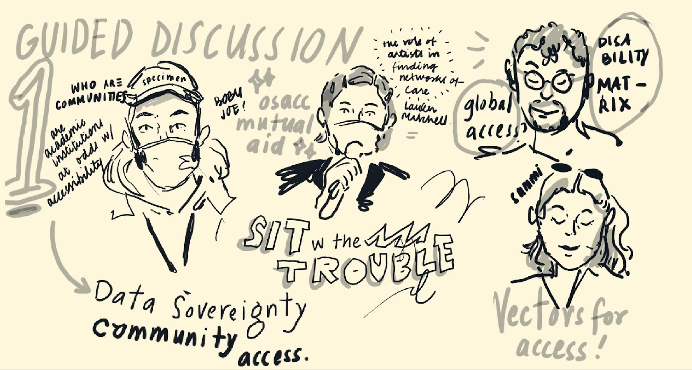
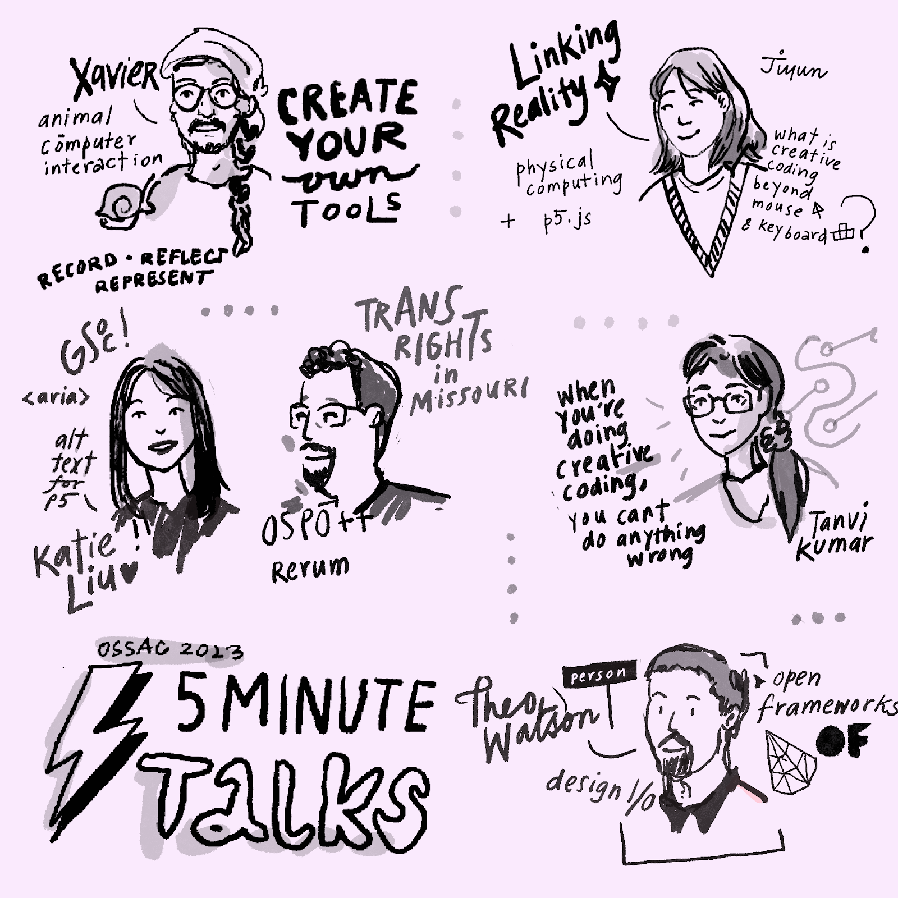
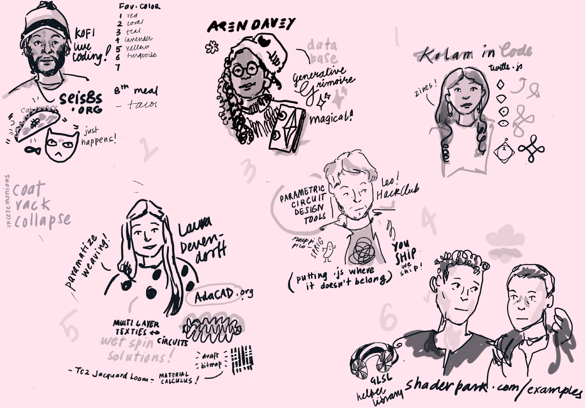

## OSACC Reflection: p5.js and access

Tanvi Sharma

I don't feel like a programmer. I learned to code by watching YouTube videos, just like many others. To ‘formalize my knowledge and add credibility’, I decided to take a 'media languages' class during my bachelor's program. Completing the assignments and practicing more, I grew more comfortable experimenting with p5; creating things like a Twitter bot, a jumping frog, and a music visualizer. However, this was a solitary exercise. I find it easier to come up with ideas around conceptual problems I want to address, but unlike /when I think of myself as/ a designer, I find it harder to grow things into something that touches other people. I feel too abstract, as if being able to concretely solve problems and identify as a programmer is somewhat beyond my grasp. I struggle with this aspect of identity in other areas of my life too. I’ve been in the United States for seven years now. It's hard to say what’s my true home turf. There are days I don’t feel progressive enough, queer enough, brown enough, and so on. A resident alien, I question where I’m allowed to be.

I attended the Open Source Art Contributor's Conference (OSACC) in Denver this year. Visiting Denver in the summer for the first time might leave you a bit breathless. The summer can be unbearably hot. The higher altitude leads to a scarcity of oxygen. It's somewhat akin to stepping into a new community or trying out a new tool or language – you have great ideas, but first, you need to catch your breath. It takes some getting used to. As you push yourself,  it helps when the people around you encourage you to drink more water, take more rest.
Imposter syndrome occasionally creeps in. Everyone else seems to be getting by fine. Am I the only one feeling discouraged? Maybe I’m just not trying to breathe hard enough. I question whether I can truly call myself a developer, a technologist — wondering who is entitled to use that term. 

To feel a cool breeze blowing in such a situation is a relief. I can keep going for a bit longer. For me, the p5 community is a welcoming reprieve in an otherwise intimidating place. I can talk a little louder, loosen up a little. As my friend Tanvi K. puts it, When you’re creative coding, you can’t do anything wrong. In a room full of ‘qualified’ individuals, some of whom have an impressive impact in the world of computing and making, it’s easy to feel like an imposter. The OSACC meet up was a revelatory experience in how I think of myself in the context of programming — at OSACC, I feel like I didn't have to prove myself as a part of the group, it was a given. I was openly welcomed to contribute to parts like mission statements, community vision etc. People at the conference volunteered to show everyone the ropes of how to do things like view open issues in the p5 GitHub repositories, submit pull requests and define what contributing means for themselves. Sometimes, caring about the project, and showing up for the community is what you need to do as a contributor. 
That said, being accepted by technology is not the answer I’m looking for. I cannot thoroughly enjoy things without criticizing them, and questions of what advancements in technology mean for the ecology, what is sustainable, how do we decrease harm when dealing with ‘intelligence’ underline my ambivalent relationship. Technology is flawed, much like us who use it. Where do we go from there? For me, thinking about my role as an early-career professional who has to participate in some of the systems in industry and academia that I know perpetuate the perils of capitalism is paralyzing. Yet, I was moved by how people encouraged and curated hope. Together we manifested that ultimately what's valuable is that we must practice an ecology of care. Discussing our concerns around how technology intersects with class struggle, environmental impact, notions of solidarity were key in building a sense of community. People at OSACC were radically unafraid to be vulnerable, and had heart to heart conversations, without any pretensions of seniority or hierarchy.  We recognised and celebrated each other, whilst being nimble enough to acknowledge any errors we might make along the way. For me, that is the true core of access, to be able to cut through the grime and address something at its root; how it wants to be addressed. 

These conversations are simultaneously empowering and draining. The organizers of OSACC  did a particularly good job of letting people opt in and out, maintaining that participation is consensual. At times I too felt tired and would go recharge my batteries in a patch of grass. 
In my experience, the stewards of the p5 community extend a thoughtfulness and care that fosters drawing breath from multiple directions and fields of query — you can talk about alt text, trans rights, mutual aid, disability, parametric weaving, south asian pattern making, animal-computer interaction, and let that define your narrative of creative coding. It's a special cross dimensional access that lets me celebrate what makes me vulnerable.The tech world often portrays a narrow stereotype of the nerdy engineer, leaving little room to explore other ways to approach programming and development. For once, I feel like I've found a place where I can comfortably fit in and breathe easy. 

