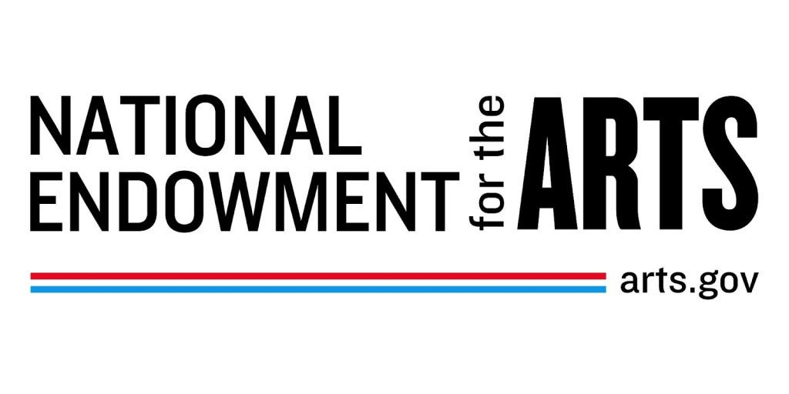
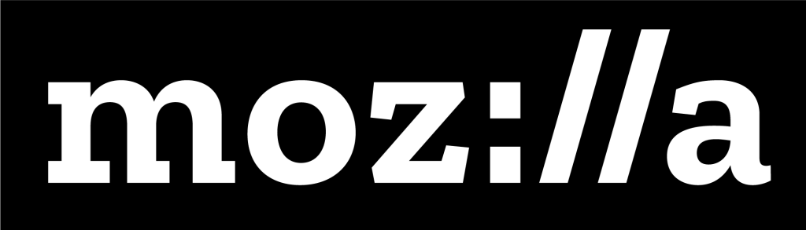
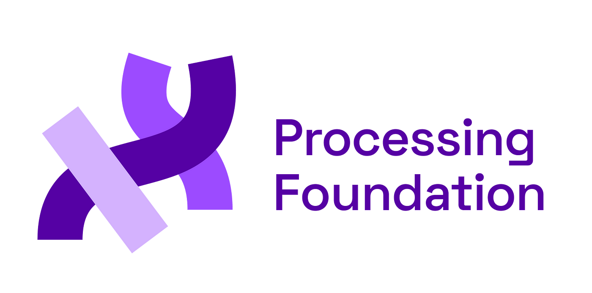
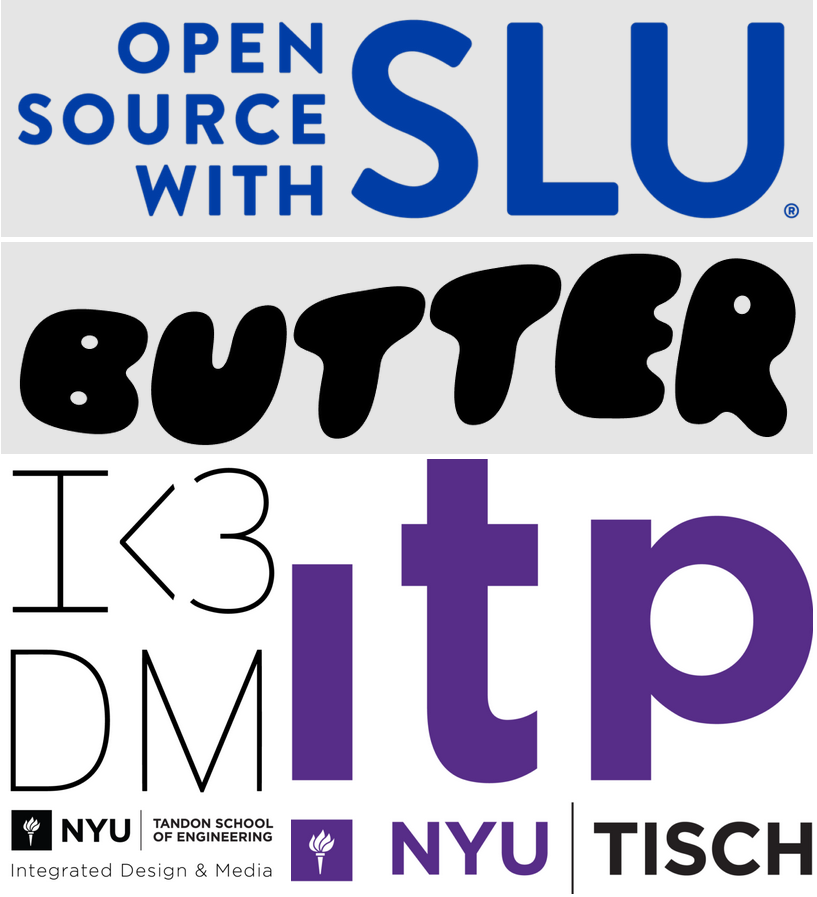
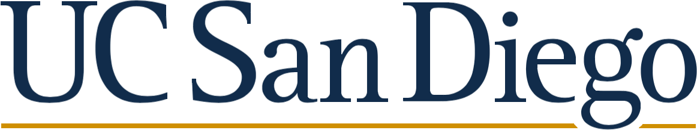
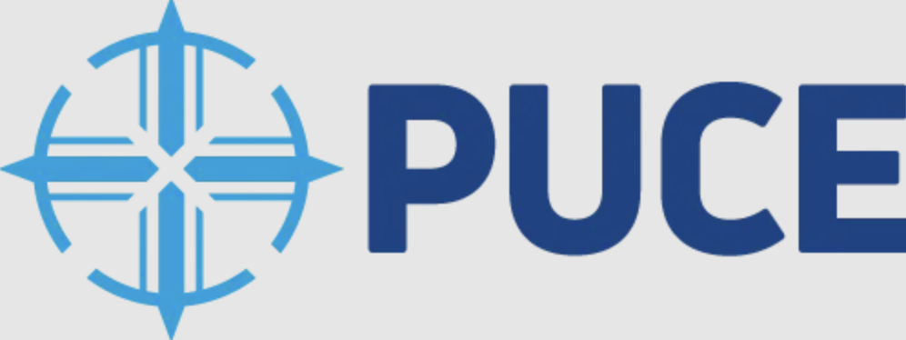
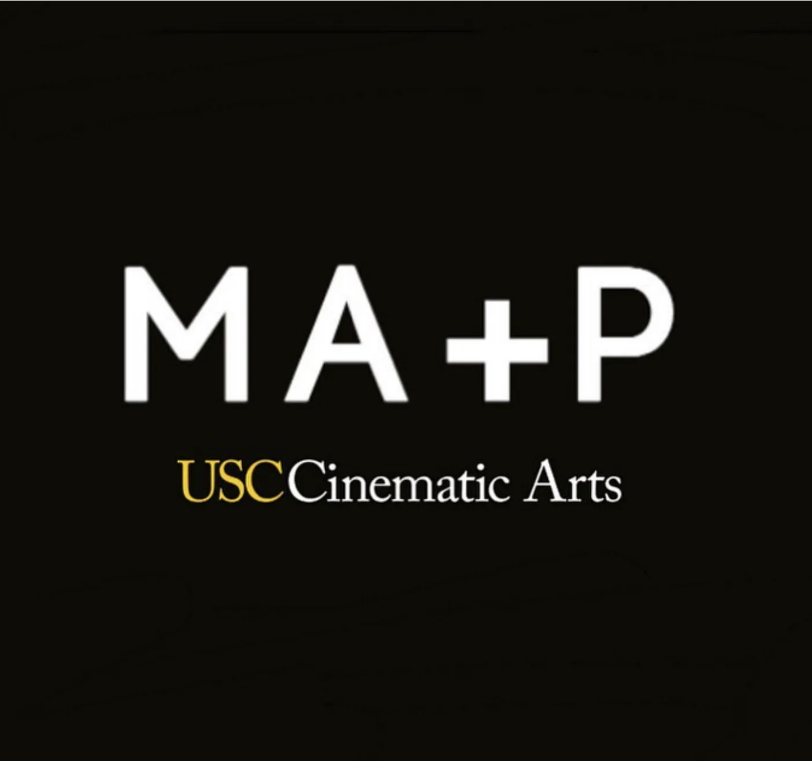

# p5.js Access Report at Open Source Arts Contributors Conference (OSACC) 

## Table of Contents

* i. [**Overview**](#i-overview)
* ii. [**Takeaways**](#ii-takeaways)
* iii. [**Credits**](#iii-credits)
* iv. [**Sponsors**](#iv-sponsors)

1. [**p5.js Working Group**](1-p5.js-working-group/working-group.md)
2. [**Guided Discussion**](/2-guided-discussion)
   * [Access](/2-guided-discussion/1-access-guided-discussion.md)
   * [Future Thinking/AI](/2-guided-discussion/2-future-thinking-ai-guided-discussion.md)
   * [Education](/2-guided-discussion/3-education-guided-discussion.md)
4. [**Access Centered Organizing**](3-access-centered-organizing/organzing.md)
5. [**Reflection**](/4-reflection)
   * [By Caleb Foss](4-reflection/reflection-by-caleb-foss.md)
   * [By Dave Pagurek](4-reflection/reflection-by-dave-pagurek.md)
   * [By Kenneth Lim](4-reflection/reflection-by-kenneth-lim.md)
   * [By Munus Shih](4-reflection/reflection-by-munus-shih.md)
   * [By Nat Decker](4-reflection/reflection-by-nat-decker.md)
   * [By Qianqian Ye](4-reflection/reflection-by-qianqian-ye.md)
   * [By Rachel Lim](4-reflection/reflection-by-rachel-lim.md)
   * [By Raphaël de Courville](4-reflection/reflection-by-raphaël-de-courville.md)
   * [By Sammie Veeler](4-reflection/reflection-by-sammie-veeler.md)
   * [By Tristan Espinoza](4-reflection/reflection-by-tristan-espinoza.md)

## i. Overview
We are thrilled to share this report documenting a convening of the Open Source Arts Contributor’s Conference (OSACC), organized by Chris Coleman, Kate Hollenbach, Qianqian Ye, Shawné Michaelain Holloway, Xin Xin, and Tsige Tafesse in Denver, Colorado on April 13-15, 2023.

This event was a three-day conversation and ‘unconference’, populated by more than 70 founders, maintainers, and contributors of Open Source Software Toolkits for the Arts (OSSTA) such as [p5.js](https://p5js.org/),  [Processing](https://processing.org/),  [ml5.js](https://ml5js.org/),  [openFrameworks](https://openframeworks.cc/),  [Hydra](https://hydra.ojack.xyz/),  [Netnet](http://netnet.studio/),  [New Art City](https://newart.city/),   [OPENRNDR](https://openrndr.org/), [Shaderpark](https://shaderpark.com/),  [Sonic Pi](https://sonic-pi.net/), and more.

The conference was formatted with time blocks for guided discussions and working sessions. Guided discussions were designed to broaden the scope of our collective thinking on the topics of Access, Education, Sustainability, and AI/Future Thinking. Working sessions provided opportunities for people to learn from and contribute to various software projects. To help folks make connections across projects and make space for new contributors, lightning talks were presented throughout the conference by any attendees who wanted to share their work.

The p5.js working groups at the OSACC is part of an ongoing effort by p5.js to promote access and inclusion. At the [2019 Contributors Conference](https://p5js.org/community/contributors-conference-2019.html), p5.js committed to only adding features to p5.js that increase access (meaning inclusion and/or accessibility). This means considering the vectors of diversity (e.g. gender, social, economic, race, ethnicity, language, disability, etc.) that can impact access/participation; and taking action to acknowledge, dismantle, and prevent barriers. The [2022 p5.js Access Day](https://p5js.org/community/p5js-access-day-2022.html) featured four themed sessions— Critical Web Accessibility, Disability Arts, Access & Community Building, and Access via Translation. The p5.js community has worked on projects such as developing new accessibility features, providing multi-language documentation, and centering the work of marginalized groups in the p5.js community.

This report aims to focus p5.js’s effort in access and highlight the intersectionality and expansiveness of accessibility work in OSSTA communities. As we identify challenges and the continued effort for greater access, we hope to inspire community members to consider how access and care can be centered in their work. We recognize that there are many more toolkits, contributors, and perspectives than those represented by this one convening. We see this as a conversation that can hopefully spark others and contribute to an ongoing dialogue. We offer our deepest gratitude to the participants of the convening, and the many, many other contributors to p5.js and toolkits.

## ii. Takeaways
We summarized 6 takeaways from the p5.js working groups and guided discussions. The takeaways here focus on suggestions to increase access to Open Source Software Toolkits for the Arts (OSSTA).

#### 1. Care work in open-source software projects is essential but often not recognized.
Working with open source software is working with people. While much attention has often been paid to the technical aspects of OSSTA development, little attention has been given to the importance of care work in sustaining the community. Making new contributors feel safe and comfortable is care work. Recognizing and highlighting contributions, no matter how ‘small’, is care work. Reminding contributors to take a break to avoid burnout is care work. Care work is a fundamental aspect of the OSSTA community and it must be recognized and valued as such. Recognizing and compensating care work, promoting self-care and community-care, and nurturing a culture of mutual support are pivotal actions in making OSSTA more accessible and inclusive, particularly for vulnerable communities.

#### 2. Decentralized leadership model increases access to engaged contributors, allowing them to participate in the decision-making process.
The p5.js project follows a ‘Contributor-Steward-Maintainer’ model for decision-making and governance, both online and through in-person p5.js contributor conferences. This still-involving model involves active contributors who take the role of stewards, while maintainers are responsible for overseeing and managing the project's development. Stewards play a vital role as highly engaged contributors, actively contributing to the project's codebase and discussions. Some active and engaged stewards will be invited to join the maintainer group with access to merge pull requests and overall decision-making.

#### 3. In supporting a decentralized leadership model, funding is integral in keeping community and access work alive.
As a decentralized leadership model requires the support of various positions, funding is an important way of supporting the work of these contributors, especially as many OSSTA contributors are those in marginalized/underrepresented communities. Additionally, transparency and sharing of resources for funding are needed to uplift each other's projects within the community.

#### 4. Documentation allows for more people to enter and maintain the space, and translation expands those doors to a greater community.
Documentation is an integral part of access and OSSTA culture. Strong documentation provides transparency. Whether it be the thought process or logic behind the code or summary of a conference, documentation increases access for both beginners who want to learn more to enter a space and for contributors who help maintain the work of the community. As much as documentation is important, translation is just as fundamental in access work. As OSSTAs and digital technology have not been evenly distributed globally, translation work addresses this disparity by directly engaging communities that face intersectional barriers to accessing a more digitized world. In translation work, the documentation of past translation processes and standardization of translated OSSTA terms helps onboard incoming translation contributors and streamline the translation update process.

#### 5. Communication and engagement should go beyond GitHub.
Effective communication within the community is critical for building trust and fostering a positive atmosphere.  Encourage open and respectful discussions, and actively engage with contributors and users through various in-person activities and online channels, like the Processing Forum, p5.js Discord channels, etc.

#### 6. More dialogues and discussions are needed surrounding AI’s impact on OSSTA.
While AI has been used as a tool to assist with day-to-day tasks and fostering creativity, a comprehensive assessment of its implications for OSSTA is vital. We must be mindful of the coexistence of certain corporate-driven AI tools with potential infringements on labor rights, privacy, and inclusivity. Safeguarding contributors' creations against exploitation by tech giants becomes a paramount concern. Given that AI tools draw from existing datasets, it becomes imperative to scrutinize the representation of various communities and the consent mechanisms governing data utilization. To forge a more ethical and responsible AI future, we as a community must share resources and strategize the use of AI by looking into alternative models.

## iii. Credits
The 2023 OSSACC in Denver, Colorado was a project of the Clinic for Open Source Arts (COSA) and the Processing Foundation.

#### Event Co-Organizers:
 * [Chris Coleman](https://digitalcoleman.com/)
 * [Kate Hollenbach](https://www.katehollenbach.com/)
 * [Qianqian Ye](http://qianqianye.com)
 * [Shawné Michaelain Holloway](https://shawnemichaelainholloway.com/)
 * [Xin Xin](https://xin-xin.info/)
 * [Tsige Tafesse](https://www.linkedin.com/in/tsige/)

#### Report Authors:
 * [Qianqian Ye](http://qianqianye.com)
 * [Karen Abe](http://karenabe.com)

This report is inspired by the [OSSTA Report](https://github.com/CreativeInquiry/OSSTA-Report) authored by Lauren Lee McCarthy, Tom Hughes, and Golan Levin. This document is released under a Creative Commons Attribution-ShareAlike 4.0 International license (CC BY-SA 4.0).

## iv. Sponsors
The 2023 OSSACC in Denver, Colorado was made possible by an award from the National Endowment for the Arts, Community Building Award from Mozilla, and funding from the Processing Foundation.

And was realized with the support from: Open Source with SLU, BUTTER, NYU IDM, NYU ITP, UAL: creative computing institute, UC San Diego, PUCE, USC Cinematic Arts MA+P.

